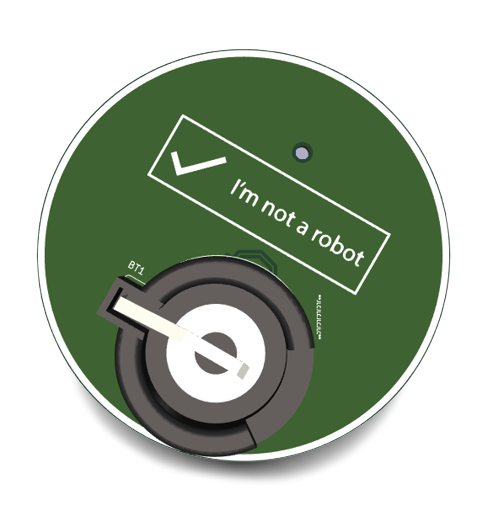

# RSA-PCB-Badge
A Robotic Student Association PCB Badge which was designed and soldered at a workshop

<!-- PROJECT LOGO -->
 

  
  <h1 align="center">RSA-Badge v1.0</h1>
  

    
  

  

   
## About The Project
This printed board circuit (pcb), the RSA badge, is meant to be used to learn about PCB design and hardware. It was designed and developed as part of the PCB design workshop as a beginner friendly introduction to the world of hardware.

## Learn more
You can follow the slides from the workshop (part one) [here](https://docs.google.com/presentation/d/1rfjJbtmV363k_88A-ob4LZY-vbHJMEZujSK3JvL_T38/edit?usp=sharing) 

## Features
A board with a blinky LED powered by a CR2032 3V cell that you can pin anywhere! 

## Contributing
Any contributions you make are greatly appreciated.
- Create new examples and submit them in a github issue and upload files.
- You can also submit examples via merge request if you are comfortable with using git.
- Replicate the badge and give feedback. 

## Contact
RSA website: [rsadelft.nl](https://rsadelft.nl/))
